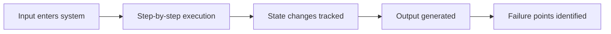

# DeepTrace

<div align="center">

[](https://github.com/muxover/deeptrace/actions/workflows/ci.yml)
[](LICENSE)

**Deep, evidence-based debugging skill for AI agents.**

</div>

---

DeepTrace is an agent skill for Cursor and Claude Code. Most code review skims the text and guesses what happens at runtime. DeepTrace makes the agent look instead. It maps the project, runs it, and traces what actually executes before it draws a conclusion. The skill comes with a few small tools: a project scanner, a test and build runner, and runtime tracers for Python, JavaScript, Go, and Rust. Because of those tools, the findings come from real behavior rather than from how the code reads, and the report follows the same shape every time.

---

## Features

- Maps, runs, and traces a real project instead of reading pasted snippets.
- Works through six levels of analysis, from plain logic down to real failures.
- Walks execution step by step: inputs, state changes, output, and where it breaks.
- Reads the code as a developer, a user, an attacker, and under load.
- Says "not defined in provided context" rather than inventing behavior it cannot see.
- Reports findings in a fixed format with severities and a confidence score.
- Carries security, performance, API, and UI lenses in one skill, so it traces any tool or interface.

---

## How it works

Each analysis tries to reach six levels of depth:

1. Syntax and direct logic
2. Control flow
3. State and data flow
4. Edge cases
5. System stress
6. Real-world failure simulation

It traces what actually runs instead of describing it in the abstract:



If several components talk to each other, it follows the flow across them too.

---

## Toolkit

On a real project the agent runs these tools and reads their output. They are plain Python with nothing to install.

- `recon.py` scans the project and reports its stacks, languages, entry points, biggest files, and TODO/FIXME notes.
- `run.py` finds and runs the project's tests, build, or app (Python, Node, Go, Rust, or Make) and captures the output and exit code. Pass `--dry-run` to see the command first, or `--race` to turn on the data-race detector where the stack supports it.
- `trace.py` runs a Python entry point under `sys.settrace` and records the call graph, exceptions, and any threads it spawns.
- `trace-node.js` runs a Node, JS, or TypeScript entry point under the V8 profiler and prints the call tree and the hottest functions.
- `trace-go.py` uses Delve to trace Go function calls in a program or test.
- `trace-rust.py` profiles a Rust binary or test with `cargo flamegraph`, and falls back to a backtrace run when the profiler is not installed.
- `trace-http.py` fires real requests at a running service and records the status, timing, and response shape — single calls or a replayed sequence for retry and idempotency checks. Stdlib only.
- `trace-ui.py` loads a running UI in a real browser and reports console errors, the network waterfall, and DOM/render activity. Needs Playwright; it tells you what to install when it is missing.

Python, JavaScript, TypeScript, Go, and Rust are first-class, with running services and UIs traced live over HTTP and a real browser. For anything else the agent drives that language's own tracer; see [skills/deeptrace/scripts/reference.md](skills/deeptrace/scripts/reference.md). These tools execute your code and send real traffic, so only point them at targets you trust.

---

## Examples

Each one is a full analysis in the DeepTrace output format:

- [race-condition.md](examples/race-condition.md): a check-then-act concurrency bug.
- [security-sql-injection.md](examples/security-sql-injection.md): injection and auth bypass.
- [performance-n-plus-one.md](examples/performance-n-plus-one.md): an N+1 query blowup.
- [ui-stale-closure.md](examples/ui-stale-closure.md): a React stale-closure freeze.
- [api-idempotency.md](examples/api-idempotency.md): a double-charge on retry.

---

## Installation

The skill is a single folder. Copy it into your skills directory.

Cursor (personal, all projects):

```bash
cp -r skills/deeptrace ~/.cursor/skills/deeptrace
```

Cursor (project, shared via the repo):

```bash
cp -r skills/deeptrace .cursor/skills/deeptrace
```

Claude Code: place the skill folder under your Claude Code skills directory the same way.

---

## Usage

Ask the agent to debug, audit, or trace something and the `deeptrace` skill loads on its own. It carries four domain lenses — security, performance, API, and UI — and leads with whichever the task points to. Name one to steer it, for example "use the security lens on this handler".

---

## Project Layout

```text
DeepTrace/
├── README.md                              This file
├── LICENSE                                MIT license
├── CONTRIBUTING.md                        Contributor guide
├── .gitignore                             Ignored paths
├── .editorconfig                          Editor defaults
├── .markdownlint.json                     Markdown lint rules
├── pyproject.toml                         Ruff + pytest config
├── requirements-dev.txt                   Dev dependencies (pytest, ruff)
├── .github/
│   ├── PULL_REQUEST_TEMPLATE.md           PR template
│   ├── ISSUE_TEMPLATE/
│   │   ├── bug_report.md                  Bug report form
│   │   └── feature_request.md             Feature request form
│   └── workflows/
│       └── ci.yml                         Markdown lint on push and PR
├── tests/                                 Pytest suite for the toolkit
├── examples/
│   ├── race-condition.md                  Concurrency trace
│   ├── security-sql-injection.md          Security audit trace
│   ├── performance-n-plus-one.md          Performance trace
│   ├── ui-stale-closure.md                UI state trace
│   └── api-idempotency.md                 API audit trace
└── skills/
    └── deeptrace/                         The skill
        ├── SKILL.md                       Method, workflow, and domain lenses
        └── scripts/
            ├── recon.py                   Static project map
            ├── run.py                     Polyglot test/build/run runner
            ├── trace.py                   Python runtime tracer
            ├── trace-node.js              Node/JS runtime tracer
            ├── trace-go.py                Go runtime tracer (Delve)
            ├── trace-rust.py              Rust runtime tracer (flamegraph)
            ├── trace-http.py              HTTP request/response capture
            ├── trace-ui.py                Browser UI runtime tracer (Playwright)
            └── reference.md               Tool usage + cross-language tracing
```

---

## Support matrix

The reasoning works for any language. The tooling is first-class for Python, JavaScript, Go, and Rust, and falls back to each language's own tools for the rest.

| Capability | First-class | Via native tools (agent-driven) | Not covered |
|------------|-------------|----------------------------------|-------------|
| Static map (`recon.py`) | ~20 languages, 12 manifests | any text file | semantic/call-graph analysis |
| Run tests/build (`run.py`) | Python, Go, JS, Rust, Make | any `Makefile` target | Bazel, custom toolchains, Docker-only setups |
| Runtime trace | Python (`trace.py`), JS/TS (`trace-node.js`), Go (`trace-go.py`), Rust (`trace-rust.py`) | JVM, Ruby via profilers | PHP, C/C++, C# deep tracing |
| HTTP contract (`trace-http.py`) | any HTTP service | — | gRPC, WebSocket capture |
| UI runtime (`trace-ui.py`) | any web UI via Chromium | other browsers via Playwright | native/mobile UIs |
| Race detection (`run.py --race`) | Go (`-race`) | Rust via miri/loom (manual) | Python, Node (use thread tags) |

Go tracing needs Delve, Rust call-stack profiles need `cargo flamegraph`, and UI tracing needs Playwright with Chromium. Each is detected automatically, with Rust falling back to a backtrace run and the UI and TypeScript tracers printing the exact install command when a dependency is missing. There is no sandbox and no profiling dashboard. These tools execute real code and send real traffic from your machine.

---

## Limitations

DeepTrace is a reasoning skill with a few helper tools, not a full debugger or static analyzer. The runner executes real project code, so only use it on code you trust and where running it is safe. Deterministic line-by-line tracing is Python-only; the other languages use sampling profilers or their own tracers, which can miss very short calls. The analysis is only as good as the code and output it sees, and the confidence score is the model's own estimate rather than a measurement. Check its findings before you act on them.

---

## Contributing

See [CONTRIBUTING.md](CONTRIBUTING.md).

---

## License

Licensed under the [MIT](LICENSE) license.

---

## Links

- Repository: https://github.com/muxover/deeptrace
- Issues: https://github.com/muxover/deeptrace/issues

---

<p align="center">Made with ❤️ by Jax (@muxover)</p>
