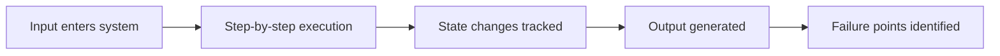

# DeepTrace

<div align="center">

[](https://github.com/muxover/deeptrace/actions/workflows/ci.yml)
[](LICENSE)
[](https://github.com/muxover/deeptrace/releases/latest)
[](#installation)

**Deep, evidence-based debugging skill for AI agents.**

</div>

---

DeepTrace is an agent skill for Claude Code, Codex, and Cursor. Most code review skims the text and guesses what happens at runtime. DeepTrace makes the agent look instead. It maps the project, runs it, and traces what actually executes before it draws a conclusion. The skill comes with a few small tools: a project scanner, a test and build runner, runtime tracers for Python, Go, and Rust, and live tracers for HTTP services and browser UIs; for Node it drives Node's own profiler. Because of those tools, the findings come from real behavior rather than from how the code reads, and the report follows the same shape every time.

---

## Features

- Maps, runs, and traces a real project instead of reading pasted snippets.
- Works through six levels of analysis, from plain logic down to real failures.
- Walks execution step by step: inputs, state changes, output, and where it breaks.
- Reads the code as a developer, a user, an attacker, and under load.
- Says "not defined in provided context" rather than inventing behavior it cannot see.
- Reports findings in a fixed format with severities and a confidence score.
- Carries security, performance, API, and UI lenses in one skill, so it traces any tool or interface.

---

## How it works

Each analysis tries to reach six levels of depth:

1. Syntax and direct logic
2. Control flow
3. State and data flow
4. Edge cases
5. System stress
6. Real-world failure simulation

It traces what actually runs instead of describing it in the abstract:


```mermaid
flowchart LR
    input[Input enters system] --> exec[Step-by-step execution]
    exec --> state[State changes tracked]
    state --> output[Output generated]
    output --> fail[Failure points identified]
```

If several components talk to each other, it follows the flow across them too.

---

## Toolkit

On a real project the agent runs these tools and reads their output. The Python tools use only the standard library; the UI, Go, and Rust tracers need Playwright, Delve, and `cargo flamegraph`, and each one prints the exact install command when its dependency is missing.

| Tool | What it gives the agent |
|------|-------------------------|
| `recon.py` | Stacks, languages, entry points (from names, manifests, and real `main` functions), biggest files, TODO/FIXME markers |
| `run.py` | Runs tests, build, or app with the project's own package manager or virtualenv. Kills the whole process tree on timeout, passes extra args after `--`, and `--race` enables Go's race detector |
| `trace.py` | Python call graph with arguments and return values, threads, and every exception labeled caught, uncaught, or exit |
| `trace-go.py` | Delve function tracing scoped to your module, with call counts and goroutines seen |
| `trace-rust.py` | `cargo flamegraph` with the hot frames printed as text, or a full-backtrace run of the binary or tests |
| `trace-http.py` | Real request/response contract, sequence replay, and parallel repeats (`--repeat`, `--concurrency`) for race and idempotency checks |
| `trace-ui.py` | Real browser run: console errors with source lines, network waterfall with real timings, DOM and React render activity, screenshots |

Full usage is in [skills/deeptrace/scripts/reference.md](skills/deeptrace/scripts/reference.md). These tools execute your code and send real traffic, so only point them at targets you trust.

---

## Examples

Each one is a full analysis in the DeepTrace output format:

- [race-condition.md](examples/race-condition.md): a check-then-act concurrency bug.
- [security-sql-injection.md](examples/security-sql-injection.md): injection and auth bypass.
- [performance-n-plus-one.md](examples/performance-n-plus-one.md): an N+1 query blowup.
- [ui-stale-closure.md](examples/ui-stale-closure.md): a React stale-closure freeze.
- [api-idempotency.md](examples/api-idempotency.md): a double-charge on retry.

---

## Installation

DeepTrace is one skill folder with its tools inside, so it installs the same way in every agent that reads `SKILL.md` skills. The tools need Python 3.9 or newer.

**Claude Code** — install the plugin:

```text
/plugin marketplace add muxover/deeptrace
/plugin install deeptrace@deeptrace
```

**Codex** — add the marketplace and install the plugin:

```bash
codex plugin marketplace add muxover/deeptrace
codex plugin add deeptrace@deeptrace
```

**Cursor** — open **Customize**, add `muxover/deeptrace` with **From GitHub Repository**, then install DeepTrace. Or install the skill from your terminal:

```bash
npx skills add muxover/deeptrace -a cursor
```

**Any other agent** (GitHub Copilot, Gemini CLI, Windsurf, and others) — the `skills` installer picks the right folder for each agent:

```bash
npx skills add muxover/deeptrace
```

**Manual** — copy the folder into your agent's skills directory:

```bash
git clone https://github.com/muxover/deeptrace.git
cp -r deeptrace/skills/deeptrace ~/.claude/skills/deeptrace      # Claude Code, all projects
cp -r deeptrace/skills/deeptrace ~/.agents/skills/deeptrace      # Codex and Cursor, all projects
```

---

## Usage

Ask the agent to debug, audit, or trace something and the `deeptrace` skill loads on its own. Call it directly with `/deeptrace` in Claude Code (`/deeptrace:deeptrace` when installed as a plugin).

It carries four domain lenses (security, performance, API, and UI) and leads with whichever the task points to. Name one to steer it:

- "use deeptrace on the checkout flow, something double-charges on retry"
- "use the security lens on this handler"
- "why does this page freeze after the second click?"

---

## Project Layout

```text
deeptrace/
├── skills/deeptrace/
│   ├── SKILL.md                  # The skill: method, workflow, domain lenses, report format
│   └── scripts/
│       ├── recon.py              # Static project map: stacks, entry points, hotspots, markers
│       ├── run.py                # Detects and runs tests, build, or app; --race for Go
│       ├── trace.py              # Python call graph, arguments, returns, exceptions, threads
│       ├── trace-go.py           # Go function tracing through Delve
│       ├── trace-rust.py         # Rust flamegraph or full-backtrace run
│       ├── trace-http.py         # HTTP contract capture, replay, and parallel repeats
│       ├── trace-ui.py           # Real-browser UI trace through Playwright
│       └── reference.md          # Tool usage, Node profiling, other languages
├── examples/                     # Five full analyses in the DeepTrace report format
├── .claude-plugin/               # Claude Code plugin and marketplace
├── .cursor-plugin/               # Cursor plugin and marketplace
├── .agents/plugins/              # Codex plugin marketplace
├── plugin.json                   # Agent Plugins manifest (Codex)
├── tests/                        # Tool tests, end-to-end tracer runs, manifest checks
├── release-notes/                # One file per release
└── docs/PROJECT.md               # Maintainer notes
```

---

## Support matrix

The reasoning works for any language. The tooling is first-class for Python, Go, and Rust, plus live HTTP services and browser UIs, and uses each language's own tools for the rest, including Node's built-in profiler.

| Capability | First-class | Via native tools (agent-driven) | Not covered |
|------------|-------------|----------------------------------|-------------|
| Static map (`recon.py`) | ~20 languages, 12 manifests | any text file | semantic/call-graph analysis |
| Run tests/build (`run.py`) | Python, Go, JS, Rust, Make | any `Makefile` target | Bazel, custom toolchains, Docker-only setups |
| Runtime trace | Python (`trace.py`), Go (`trace-go.py`), Rust (`trace-rust.py`) | Node/JS/TS via `node --cpu-prof`, JVM and Ruby via profilers | PHP, C/C++, C# deep tracing |
| HTTP contract (`trace-http.py`) | any HTTP service | — | gRPC, WebSocket capture |
| UI runtime (`trace-ui.py`) | any web UI via Chromium | other browsers via Playwright | native/mobile UIs |
| Race detection | Go (`run.py --race`), live services (`trace-http.py --concurrency`) | Rust via miri/loom, Python via thread-tagged traces | Node in-process races |

Go tracing needs Delve, Rust call-stack profiles need `cargo flamegraph`, and UI tracing needs Playwright with Chromium. Each is detected automatically, with Rust falling back to a backtrace run and the UI tracer printing the exact install command when a dependency is missing. There is no sandbox and no profiling dashboard. These tools execute real code and send real traffic from your machine.

---

## Limitations

DeepTrace is a reasoning skill with a few helper tools, not a full debugger or static analyzer. The runner executes real project code, so only use it on code you trust and where running it is safe. Deterministic line-by-line tracing is Python-only; the other languages use sampling profilers or their own tracers, which can miss very short calls. The analysis is only as good as the code and output it sees, and the confidence score is the model's own estimate rather than a measurement. Check its findings before you act on them.

---

## Contributing

See [CONTRIBUTING.md](CONTRIBUTING.md).

---

## License

Licensed under the [MIT](LICENSE) license.

---

## Links

- Repository: https://github.com/muxover/deeptrace
- Issues: https://github.com/muxover/deeptrace/issues
- Changelog: [CHANGELOG.md](CHANGELOG.md)

---

<p align="center">Made with ❤️ by Jax (@muxover)</p>
